# pico-crt-clock

[MicroPython](https://github.com/micropython/micropython) firmware for a
Raspberry Pi Pico W, using
[pico-mposite](https://github.com/breakintoprogram/pico-mposite) on RP2040
core1 to generate a monochrome PAL-ish composite video signal while core0 runs
MicroPython and a custom `gfx` module.

This project started as an attempt to give a small 5.5" black-and-white CRT TV
a new job as a clock and weather display. That original use case is still here,
but the repo has since grown into a more general composite-video MicroPython
base with a reusable graphics API and a set of bundled example apps.

The `gfx` module provides a general-purpose API for composite video output:
pixel drawing, text, sprites, and screen control for MicroPython projects that
need a simple monochrome display. The bundled firmware can drive any TV,
monitor, or other display chain that accepts a PAL-ish composite signal, not
just vintage CRT sets.

The repo ships with configurable example apps selected from `config.py` via the
`APPS` list (see [Configuring apps](#configuring-apps)). The default set is:

| App | GPIO | Description |
|---|---|---|
| Weather | GPIO 10 | Live clock, temperature, wind, 3-day forecast from [Open-Meteo](https://open-meteo.com) (no key needed) |
| News reader | GPIO 12 | Scrolling Guardian API headlines with full / summary / RSVP switch on GPIO 13 + 14 |
| Sky | GPIO 11 | Sun rise/set, moon phase, 24h aurora / KP-index forecast from [NOAA SWPC](https://www.swpc.noaa.gov/) |

Optional extras that can be added to `APPS`:

| App | Description |
|---|---|
| Electricity | 24h Nord Pool hourly spot price bar chart from [Elering Dashboard API](https://dashboard.elering.ee) (FI/SE/NO/DK/EE/LV/LT), optional tomorrow view on a shared detail GPIO, configurable spot VAT plus VAT-inclusive tax / transfer / margin adders |
| Torus demo | Animated 3D spinning torus; the original show-off demo |

If no GPIO is pulled low, the first entry in `APPS` runs by default.

For a deeper look at how the bundled apps are implemented, including the RAM-
saving and flicker-reduction techniques used in each one, see the app
technical notes in
[APPS_README.md](APPS_README.md).

---

## Gallery

Real hardware example:


Simulator captures:

<table>
  <tr>
    <td align="center"><strong>Weather</strong><br>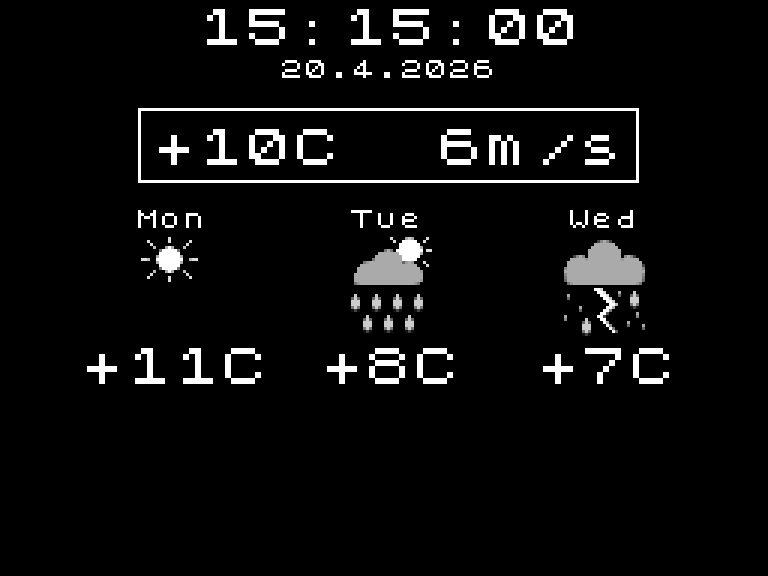</td>
    <td align="center"><strong>News: summary</strong><br>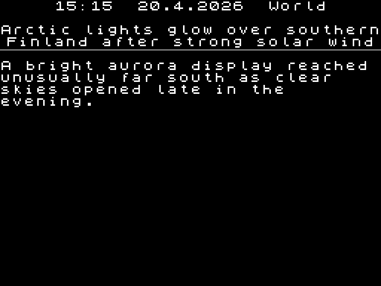</td>
    <td align="center"><strong>News: full</strong><br>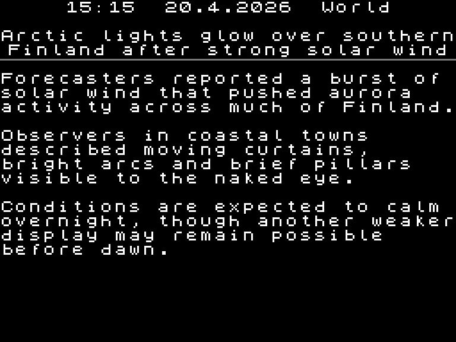</td>
  </tr>
  <tr>
    <td align="center"><strong>News: RSVP</strong><br>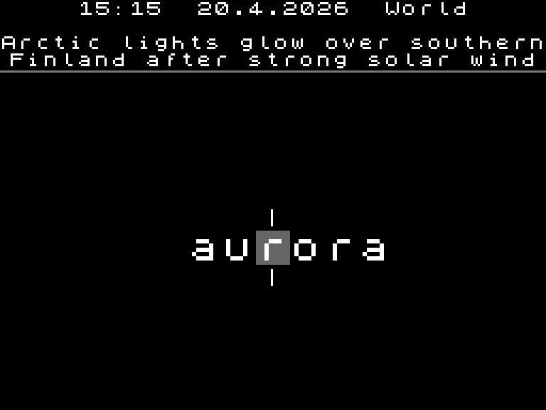</td>
    <td align="center"><strong>Sky</strong><br>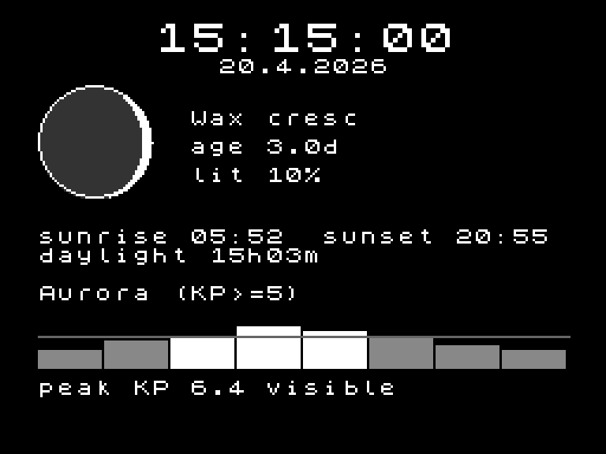</td>
    <td align="center"><strong>Electricity: today</strong><br>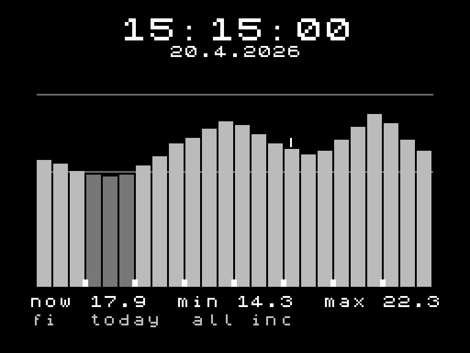</td>
  </tr>
  <tr>
    <td align="center"><strong>Electricity: tomorrow</strong><br>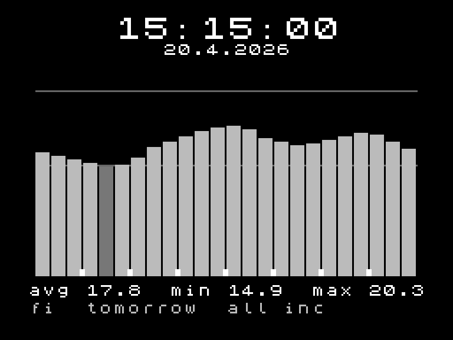</td>
    <td align="center"><strong>Torus</strong><br>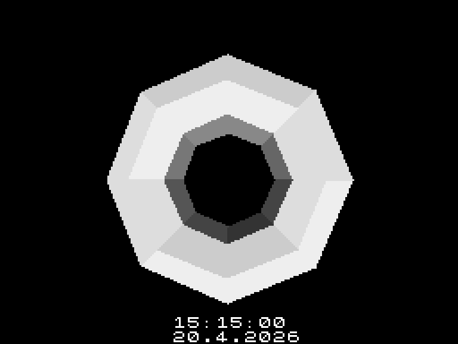</td>
    <td></td>
  </tr>
</table>

The simulator images above are 3x nearest-neighbour captures of the 256x192 framebuffer, so they stay readable on GitHub without looking blurred.

https://github.com/user-attachments/assets/1162584c-b029-4f1c-9379-bf67870d685d

---

## Hardware

| Item | Detail |
|---|---|
| MCU board | Raspberry Pi Pico W (WiFi used for NTP and network-backed apps) |
| Display | Any TV or monitor accepting a composite PAL signal |
| DAC | See [Video output options](#video-output-options) below |

The firmware maps palette indices **0 (black) ... 15 (white)** to 5-bit DAC
values. The exact mapping depends on the hardware variant — see below.

> **Important:** The firmware is calibrated for the hardware variant it was
> built for. Build with `./build.sh <variant>` and flash only to a Pico
> running the matching hardware. Mismatching firmware and hardware will produce
> incorrect signal levels.

---

## Video output options

Three hardware variants are supported. Choose one and build the matching
firmware with `./build.sh <variant>`.

| Variant | `build.sh` arg | Hardware | Notes |
|---|---|---|---|
| Ladder | `ladder` | R-2R resistor ladder only | Simple; not 75 Ω matched — for initial testing |
| Ladder + buffer | `buffer` | R-2R ladder + 2SC1815 emitter follower | Better impedance match; software LUT corrects levels |
| Summing amp | `amp` | Weighted resistor network + THS7314 | Recommended; clean, standards-correct output |

### Ladder (basic)

The simplest option: eleven resistors on GP0–GP4 form an R-2R ladder DAC.

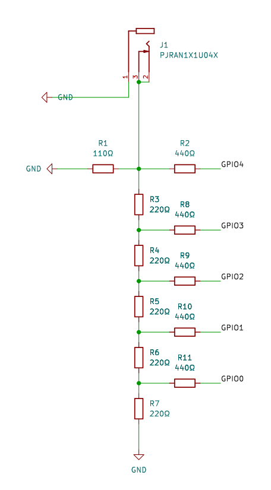

| Value | Meaning |
|---|---|
| 0x00 | Sync tip |
| 0x0D | Black (blanking level) |
| 0x1F | White (peak luminance) |

The ladder presents roughly 110 Ω output impedance. Real composite inputs
terminate at 75 Ω, so connecting the ladder directly creates a voltage divider
that shifts and attenuates all levels. This is fine for a quick smoke-test
but will look wrong on a real display. Use the `buffer` or `amp` variant for
correct signal levels.

### Ladder + buffer (`buffer`)

Build the ladder above, then add a 2SC1815 NPN emitter follower between the
ladder output and the display. The buffer lowers the output impedance to
approximately 75 Ω. A corrected 16-entry colour LUT in the firmware maps
palette indices to DAC values that place the black level at the composite
standard (~300 mV), since the R-2R ladder output is linear and does not
inherently land at the correct voltage.

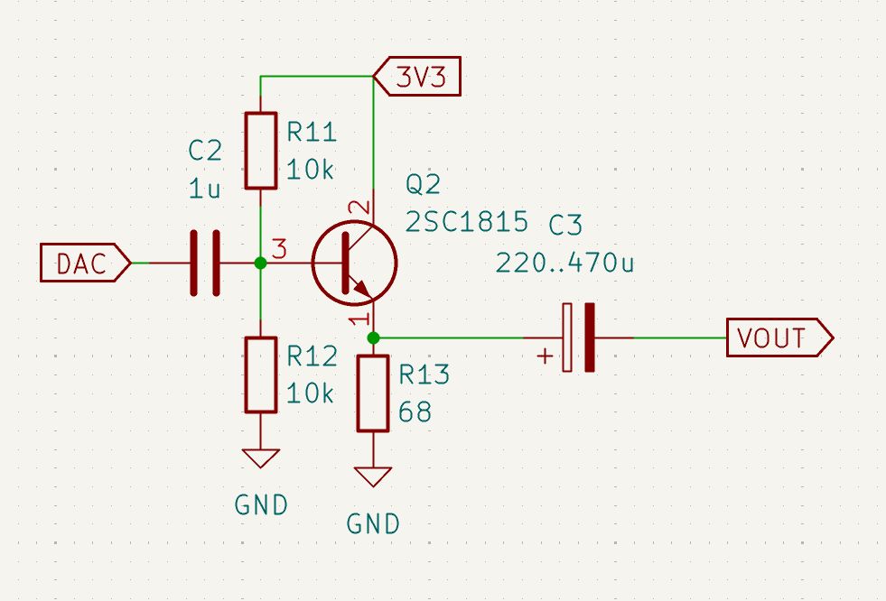

| Part | Value | Function |
|---|---|---|
| C2 | 1 µF | AC-couples the DAC signal into the base bias network |
| R11 | 10 kΩ | Pull-up to 3V3; sets base bias with R12 |
| R12 | 10 kΩ | Pull-down to GND; sets base bias midpoint |
| Q2 | 2SC1815 | NPN emitter follower; unity voltage gain, low output impedance |
| R13 | 68 Ω | Emitter resistor; sets the operating point to ~15 mA emitter current |
| C3 | 220–470 µF | AC output coupling cap; **330 µF minimum** — 220 µF may give a soft picture |

| Value | Meaning |
|---|---|
| 0x01 | Sync tip |
| 0x0B | Black (blanking level) |
| 0x1F | White (peak luminance) |

### Summing amp — recommended (`amp`)

A weighted resistor network sums the 5-bit GPIO output into a voltage, which
a THS7314 video amplifier IC drives onto the composite output at correct
amplitude and 75 Ω impedance. No LUT correction needed — the back porch level
is set to exactly `colour_base` (0x10) in firmware.

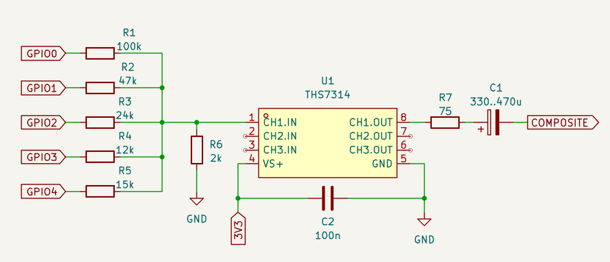

| Part | Value | Function |
|---|---|---|
| R1 | 100 kΩ | GPIO0 (LSB) summing resistor |
| R2 | 47 kΩ | GPIO1 summing resistor |
| R3 | 24 kΩ | GPIO2 summing resistor |
| R4 | 12 kΩ | GPIO3 summing resistor |
| R5 | 15 kΩ | GPIO4 (MSB) summing resistor |
| R6 | 2 kΩ | Shunt resistor; converts summed current to voltage at CH1.IN |
| U1 | THS7314 | Triple SD video amplifier; fixed 2× gain; drives 75 Ω loads |
| R7 | 75 Ω | Series output resistor; forms 75 Ω source impedance with U1 |
| C1 | 330–470 µF | AC output coupling cap to composite connector |
| C2 | 100 nF | Supply bypass cap on VS+ |

The THS7314 fixed 2× gain compensates for the 6 dB loss of the 75 Ω
source/load divider, so the signal arrives at the display at correct composite
amplitude. Most CRT TVs and composite monitors have built-in 75 Ω termination;
if yours does not, add a 75 Ω resistor from the connector to ground at the
display end.

| Value | Meaning |
|---|---|
| 0x01 | Sync tip |
| 0x10 | Black (blanking level) |
| 0x1F | White (peak luminance) |

---

## Repository layout

```
pico-crt-clock/           project sources; build from here
  build.sh                  one-shot build + patch script
  upload.sh                 helper-script to upload files to Pico W
  micropython.cmake         build-system glue (USER_C_MODULES)
  gfx_queue.h               shared ring buffer + command struct (core0 <-> core1)
  gfx_core1.c               core1 entry point and command dispatcher
  gfx_core1.h               gfx_core1_launch() declaration
  mod_gfx.c                 MicroPython C extension module "gfx"
  main.py                   boot stub: reads the APPS list from config and dispatches
  common.py                 shared helpers: WiFi, NTP, banners, DST, HTTP stream-to-flash
  weather.py                weather app (clock + temp + wind + 3-day forecast)
  news.py                   Guardian API news reader (full / summary / RSVP switch)
  sky.py                    sky app: sun/moon times, moon phase, aurora / KP forecast
  electricity.py            Nord Pool hourly spot price chart (FI/SE/NO/DK/EE/LV/LT)
  torus.py                  spinning torus demo (original show-off; optional opt-in)
  config.py                 all user-tweakable settings (WiFi, location, APPS, per-app)
  config_local.py           optional override of config.py (gitignored pattern)
  icons.bin                 pre-generated weather icon bytearrays
  make_icons.py             PC-side icon generator (run to regenerate icons.bin)
  torus.bin                 pre-generated torus LUT data
  make_torus.py             PC-side torus LUT generator (run to regenerate torus.bin)
  gfx.py                    PC simulator mock of the gfx C extension (pygame)
  run_sim.py                runner for PC testing without hardware
  patches/
    micropython-no-thread.patch   disables MicroPython threading (see below)
    micropython-flash-freeze.patch keeps video stable during flash writes by freezing core1 in SRAM
    pico-mposite-common.patch     pico-mposite patch applied to all variants (DMA IRQ, FIFO, SRAM, GPIO drive)
    pico-mposite-buffer.patch     additional patch for buffer variant (HSHI + colour LUT)
    pico-mposite-amp.patch        additional patch for amp variant (HSHI only)
    pico-mposite-fix-scanline-order.patch  fixes y=0 rendering at bottom instead of top (applied to all variants)
    pico-mposite-c64font.patch    optional: replaces ZX Spectrum font with Commodore 64 font

micropython/          vanilla MicroPython (submodule)
pico-mposite/         vanilla pico-mposite (submodule)
pico-sdk/             vanilla pico-sdk (submodule)
```

---

## Architecture

The RP2040 has two cores. Core1 runs the pico-mposite video engine exclusively,
generating the composite PAL signal via PIO state machines and DMA. Core0 runs
MicroPython with a custom `gfx` C extension module (`mod_gfx.c`).

When a MicroPython app calls a `gfx` function, `mod_gfx.c` encodes it as a
command and pushes it into a shared ring buffer (`gfx_queue`). Core1 loops on
that queue, popping commands and dispatching them to the pico-mposite drawing
functions (`gfx_core1.c`). The two cores communicate only through the queue;
all video IRQs (`DMA_IRQ_1`, `PIO0_IRQ_0`) are owned by core1.

**Key design points**

- All video IRQs (`DMA_IRQ_1`, `PIO0_IRQ_0`) are registered from core1 so they
  fire on core1's NVIC and cannot affect core0 interrupt latency.
- `patches/pico-mposite-common.patch` redirects DMA from `DMA_IRQ_0` to
  `DMA_IRQ_1` (avoiding conflict with MicroPython's shared DMA_IRQ_0 handler),
  adds `FJOIN_TX` to double the TX FIFO depth on both PIO SMs, places ISRs in
  SRAM with `__not_in_flash_func`, sets GP0-GP4 drive strength to 2 mA / slow
  slew to reduce switching noise, and moves the framebuffer to static SRAM.
  Applied first for
  all variants. The variant-specific patches (`pico-mposite-buffer.patch`,
  `pico-mposite-amp.patch`) apply on top and carry only the HSHI value and
  colour LUT changes specific to that hardware.
- `patches/pico-mposite-fix-scanline-order.patch` fixes a bug in
  `cvideo_dma_handler` where the NULL-source pixel DMA started by
  `initialise_cvideo` leaves stale bytes in the PIO TX FIFO, causing a one-line
  pipeline slip: `bitmap[0]` (y=0) ends up on the last active scanline (bottom)
  instead of the first (top). Fix: split `case 6 ... 68` and at vline 68 (last
  top-border line, one scan period before active video) reset `bline` and preload
  `dma_channel_1` with `bitmap[0]`. Applied to all variants.
- `patches/micropython-no-thread.patch` sets `MICROPY_PY_THREAD = 0`; the
  threading ISR on `SIO_IRQ_PROC0` would consume the FIFO acknowledgement that
  `multicore_launch_core1()` blocks on, hanging core0.
- Core1 is launched with an explicit 4 KB static stack because MicroPython sets
  `PICO_CORE1_STACK_SIZE = 0`, which makes `multicore_launch_core1()` panic.
- `patches/micropython-flash-freeze.patch` replaces the old lockout behaviour
  during flash writes. Before `flash_range_erase/program`, core0 asks the video
  core to park in a tiny SRAM-only wait loop; the pico-mposite IRQ path keeps
  sync alive from SRAM while drawing pauses. The visible result is a briefly
  static picture during cache writes instead of glitches or a black screen.
- Back-to-back `gfx.blit()` calls are safe: core0 spins on `gfx_blit_busy`
  until core1 has consumed the previous sprite, then copies the next one.

---

## Prerequisites

- ARM cross-compiler: `gcc-arm-none-eabi`
- `cmake`, `make`, `git`, `python3`

On Debian/Ubuntu:

```bash
sudo apt install gcc-arm-none-eabi cmake make git python3
```

## Build

All submodules are kept vanilla. `build.sh` applies the patches before
building and reverts them on exit via `trap` — they are always restored even
if the build fails.

Pass the hardware variant as the first argument, with an optional font flag:

```bash
cd pico-crt-clock
./build.sh ladder              # plain R-2R ladder, ZX Spectrum font (default)
./build.sh buffer              # ladder + 2SC1815 emitter follower buffer
./build.sh amp                 # weighted summing network + THS7314 (recommended)
./build.sh amp --c64font       # same, but with Commodore 64 font
```

Running `./build.sh` without an argument prints a usage summary and exits.

The `--c64font` flag replaces the default ZX Spectrum 48K character set with
the Commodore 64 font (lowercase+uppercase ROM set — both cases supported).
It uses a separate build directory (`build-RPI_PICO_W-<variant>-c64font/`) so
Spectrum and C64 font builds can coexist without a clean in between.

The script:
1. Initialises top-level submodules (micropython, pico-mposite, pico-sdk) and MicroPython's own submodules (tinyusb, ...)
2. Applies `patches/micropython-no-thread.patch`, `patches/micropython-flash-freeze.patch`, `patches/pico-mposite-common.patch`, `patches/pico-mposite-fix-scanline-order.patch`, and (for `buffer`/`amp`) the variant-specific patch on top; if `--c64font` is given, also applies `patches/pico-mposite-c64font.patch`
3. Builds `mpy-cross` if needed
4. Runs cmake (out-of-tree into `../build-RPI_PICO_W-<variant>/` or `../build-RPI_PICO_W-<variant>-c64font/`) and builds the required tools
5. Builds the full firmware with the `gfx` user C module
6. Reverts all patches (via `trap EXIT`)

Each variant gets its own build directory, so you can build all three without
a clean in between.

Output: `build-RPI_PICO_W-<variant>/firmware.uf2`

### Flash

Hold BOOTSEL, plug in USB, release. Then (example for `amp`):

```bash
cp build-RPI_PICO_W-amp/firmware.uf2 /media/$USER/RPI-RP2/
```

### Deploy Python files

After the Pico reboots, connect to PC. The easiest way is the included script:

```bash
cd pico-crt-clock
./upload.sh
```

`upload.sh` copies all Python and binary files to the Pico using `mpremote`
and prompts before overwriting `config.py` (in case you have already configured
it on the device). Requires `mpremote`: `pip install mpremote`.

Alternatively, copy files manually:

```bash
mpremote fs cp pico-crt-clock/main.py    :main.py
mpremote fs cp pico-crt-clock/common.py  :common.py
mpremote fs cp pico-crt-clock/weather.py :weather.py
mpremote fs cp pico-crt-clock/news.py    :news.py
mpremote fs cp pico-crt-clock/sky.py     :sky.py
mpremote fs cp pico-crt-clock/electricity.py :electricity.py
mpremote fs cp pico-crt-clock/torus.py   :torus.py
mpremote fs cp pico-crt-clock/icons.bin  :icons.bin
mpremote fs cp pico-crt-clock/torus.bin  :torus.bin
mpremote fs cp pico-crt-clock/config.py  :config.py
```

Edit `config.py` first — it contains your WiFi credentials and all display
options. See [Configuration](#configuration) below for a full reference.

To find your coordinates, right-click your location in
[Google Maps](https://maps.google.com) and click the latitude/longitude
that appears at the top of the context menu — it copies to the clipboard.
Alternatively use [latlong.net](https://www.latlong.net).

If you change icons, regenerate `icons.bin` on the PC first:

```bash
cd pico-crt-clock && python make_icons.py
```

---

## PC simulator

```bash
cd pico-crt-clock
pip install pygame   # one-time
python run_sim.py             # ZX Spectrum font (default)
python run_sim.py --c64font   # Commodore 64 font
```

`gfx.py` is a pygame-based mock of the `gfx` C extension. Network calls are
always-connected mocks; network-backed apps fetch live data in the simulator.
Set `SCALE` in `gfx.py` to resize the window (default 3x).

For simulator use, it is good practice to make a full local copy of
`config.py` as `config_local.py` and put your real WiFi credentials and API
keys there. The simulator and firmware prefer `config_local.py` when present,
and that file is ignored by Git. This keeps secrets out of commits, which is
especially useful if you want to send changes or pull requests to this public
repository.

The `--c64font` flag selects the Commodore 64 lowercase+uppercase character set
in the simulator, matching what `./build.sh <variant> --c64font` builds into
the firmware. The window title shows which font is active.

### Simulator GPIO keys

| Key | Effect |
|---|---|
| `a` | Pull the GPIO for `APPS[0]` low → run the 1st app |
| `b` | Pull the GPIO for `APPS[1]` low → run the 2nd app |
| `c` | Pull the GPIO for `APPS[2]` low → run the 3rd app |
| `d` | Pull the GPIO for `APPS[3]` low → run the 4th app (if present) |
| `n` | Cycle the selected app's configured local-detail switch |
| `o` / `p` | Raise / lower the simulated speed potentiometer (ADC on GPIO 26) |
| `ESC` | Release all pins → run `APPS[0]` as default |

Pressing a mode key latches that mode until `ESC` is pressed, mirroring a
physical sliding switch. `n` follows the selected app's configured detail GPIOs:
it does nothing for apps with no detail pins, toggles high/low for one detail
GPIO, and keeps the three-position cycle for two detail GPIOs. The window title
shows the actual configured GPIO numbers and their current high/low state.

---

## Apps

### Weather (default)

Displays the current time, date, temperature, wind speed, and a 3-day weather
forecast with icons. All weather data is fetched from
[Open-Meteo](https://open-meteo.com) — no API key or sensors required.

Runs automatically when no `APPS` GPIO is pulled low.

### News reader

Fetches articles from [The Guardian open platform API](https://open-platform.theguardian.com)
and displays them with a smooth scrolling view. A secondary switch selects
between three reading modes without rebooting:

| Mode | What it shows |
|---|---|
| Full article | Scrolls through the complete body text |
| Summary | Short trailText — cycles quickly through all stories |
| RSVP | Rapid serial visual presentation: one word at a time, Spritz-style |

Flipping the detail switch mid-article clears the screen and reloads the same
story in the new mode.  The GPIO pins used for the detail switch are mapped by
the `modes` dict in the `APPS` entry — see [Configuring apps](#configuring-apps).
Omit the GPIO keys to lock news to a single reading mode and save two pins.
You can also configure just one of the optional detail GPIOs if you only want
two modes, for example `{"default": "summary", 14: "rsvp"}`.
Like app selection, this can be any generic switch arrangement that pulls one
detail GPIO at a time to GND. The intentionally unconnected switch position in
the example in [Configuring apps](#configuring-apps) simply leaves the detail
GPIOs unselected, so the app stays in its configured default mode. The
internal pull-ups are weak, so an external `10k` pull-up to `3V3` on each
detail GPIO is recommended.

You need your own Guardian Open Platform API key (free, 5000 requests/day):

1. Open https://open-platform.theguardian.com and register
2. Create an application to get a Content API key
3. Copy your key into `config.py` as `NEWS_API_KEY`
4. Do not commit your real key to Git

Articles are cached to flash in `newscache/` so re-entering news mode within
`NEWS_INTERVAL` seconds does not trigger a new fetch. During a refresh, the
banner shows `Fetching news...` plus a `03/16`-style counter while each article
cache file is written.

### Sky

Displays today's sun rise/set and daylight duration, the current moon phase
as a filled greyscale disc with age/illumination, and a next-24h aurora
forecast as a KP-index sparkline with a configurable visibility threshold.
Sun and moon positions are computed locally from `LATITUDE`/`LONGITUDE` and
NTP time; the KP forecast is fetched from [NOAA SWPC](https://www.swpc.noaa.gov/).

Set `SKY_AURORA_KP_VISIBLE` to the KP value that means "aurora likely at
your latitude" (rough guide: 5 at 60°N, 6 at 55°N, 3 at 70°N).

### Electricity spot price

Displays today's hourly Nord Pool day-ahead electricity price as a 24-bar chart.
If the app entry includes `modes={"default": "today", <gpio>: "tomorrow"}`,
pulling that detail GPIO low switches to tomorrow's chart after Nord Pool day-
ahead prices have been published. Before that, the chart area shows a
`No SPOT data for tomorrow yet, update at HH:MM local` hint.
This uses the same local mode-switch wiring pattern shown above for news.

Bars below `ELEC_CHEAP_CKWH` are dark grey, bars from `ELEC_CHEAP_CKWH` up to
`ELEC_EXPENSIVE_CKWH` are light grey, and bars above `ELEC_EXPENSIVE_CKWH` are
white. In today's view the current hour is marked with a tick above its bar and
the footer shows now / min / max c/kWh. In tomorrow view the footer shows
avg / min / max c/kWh.

Set `ELEC_SHOW_TOTAL = True` to display a consumer-facing total price. The app
applies `ELEC_VAT_PCT` to the raw Nord Pool spot price, then adds
`ELEC_TAX_CKWH`, `ELEC_TRANSFER_CKWH`, and `ELEC_MARGIN_CKWH` exactly as given.
Those three adders should already include VAT, because that is how they are
normally announced to consumers. Set any component to 0 to leave it out.
Supports all Elering dashboard price areas (FI / SE1-4 / NO1-5 / DK1-2 / EE /
LV / LT).

The cache logic is day-aware rather than interval-based: it fetches when
today's local data is missing, and after `ELEC_TOMORROW_RELEASE_HOUR` /
`ELEC_TOMORROW_RELEASE_MINUTE` it also refetches if tomorrow is still missing.
Partial tomorrow payloads are rejected so they do not overwrite a good cache.

### Torus (legacy demo)

Real-time 3D spinning torus rendered using fixed-point arithmetic on the
RP2040.  Not in the default `APPS` list — uncomment its line in `config.py`
to enable.

---

## Configuring apps

Which apps run, which GPIO each maps to, and how apps with local detail modes
interpret their secondary switch pins are all declared in `config.py` as the
`APPS` list.
Each entry is a tuple:

```python
APPS = [
    ("weather", 10),
    ("news",    12, {"modes": {"default": "summary", 13: "full", 14: "rsvp"}}),
    ("sky",     11),
    # ("electricity", 15, {"modes": {"default": "today", 13: "tomorrow"}}),
    # ("torus",       11),
]
```

- The first entry is the default app when no GPIO is pulled low.
- To select apps, pull one GPIO low at a time through any simple switch that
  can connect the chosen pin to GND. It does not need to be a slide switch.
- Only the Pico W's weak internal pull-ups are enabled by default. For real
  hardware, use an external `10k` pull-up resistor from each app-select GPIO
  to `3V3` so the idle state stays solid.
- Comment out any app you don't want; change the GPIOs to match your wiring.
- For news, the `modes` dict maps GPIO numbers to reading modes, with
  `"default"` as the mode shown when no mapped pin is low.  Omit the integer
  keys entirely (e.g. `{"default": "full"}`) to lock news to one mode and free
  up those GPIOs. You can also map just one detail GPIO if you only want two
  modes.
- Electricity uses the same `modes` pattern. For example,
  `{"default": "today", 13: "tomorrow"}` reuses the same secondary switch
  style as news. If electricity has no integer GPIO keys, it ignores detail
  GPIOs entirely and stays on its default view.
- The local mode switch does not need to drive every possible position. Leaving
  a switch position unconnected is valid and simply falls back to the
  `"default"` mode when no configured detail GPIO is pulled low.

Example wiring for app selection:

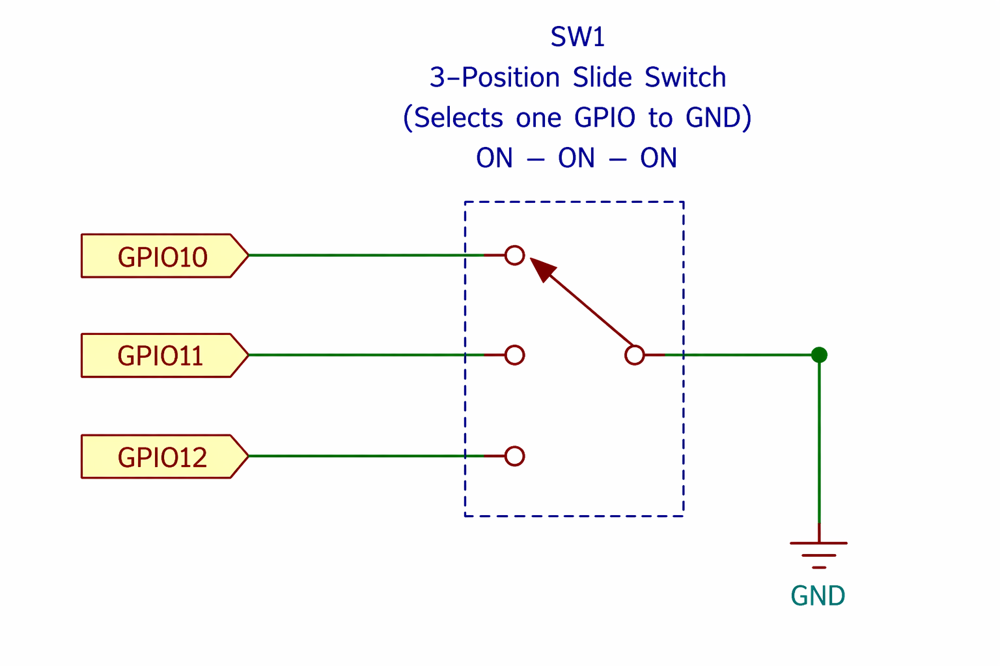

Example wiring for a local app-mode switch:

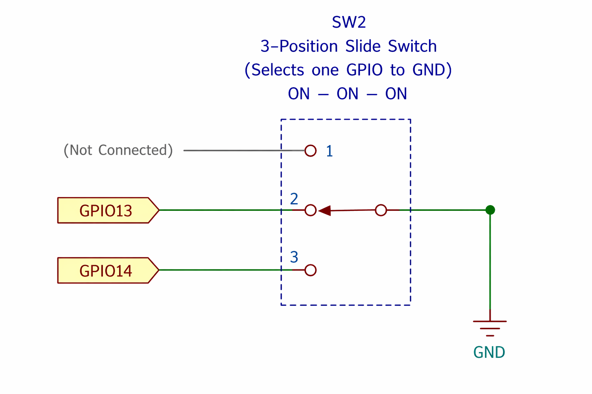

---

## Configuration

All settings live in `config.py`. Edit before deploying to the Pico.

### WiFi

```python
WIFI_SSID = "your-network"
WIFI_PASS = "your-password"
```

### Location and time

```python
LATITUDE  = 60.48        # decimal degrees
LONGITUDE = 24.11

UTC_OFFSET = 2           # base UTC offset in whole hours (without DST)
USE_DST    = True        # True = European DST rules (last Sun Mar/Oct)
```

### Display format

```python
CLOCK_12H  = False       # True = 12h with am/pm, False = 24h
DATE_ORDER = "DMY"       # DMY / MDY / YMD
DATE_SEP   = "."         # separator character
TEMP_UNIT  = "C"         # "C" or "F"
WIND_UNIT  = "ms"        # "ms", "kmh", "mph", "kn"
```

### Screen saver

```python
SCREENSAVER_SPEED = 2    # 0=fastest drift, 999=disabled
```

### Weather

```python
WEATHER_INTERVAL       = 30 * 60   # refresh interval (seconds)
FORECAST_NEXT_DAY_HOUR = 18        # hour after which forecast shows tomorrow first
```

### News

```python
NEWS_API_KEY    = "your-own-guardian-api-key"
# section:count; count defaults to NEWS_COUNT
NEWS_SECTIONS   = "world:6,technology:4,politics:6"
NEWS_COUNT      = 4      # default articles per section (when no count given in NEWS_SECTIONS)
# cache refresh interval (seconds)
NEWS_INTERVAL   = 2 * 60 * 60

NEWS_HOLD       = 15     # seconds to hold full article initial screen before scroll
NEWS_HOLD_SUM   = 8      # seconds to hold summary (never scrolls)
NEWS_HOLD_AFTER = 3      # seconds to hold after scroll completes

NEWS_BODY_LINES = 105    # max wrapped lines stored per article (0 = unlimited)
                         # ~19 lines fill one screen; 105 ≈ 5 screens
                         # truncated articles show "[article truncated]" at the end

NEWS_SCROLL_SPEED = 150  # extra ms delay per pixel (larger = slower scroll)
                         # 125 ≈ one row per second
```

`NEWS_API_KEY` must be your own key from the Guardian Open Platform:
https://open-platform.theguardian.com

Available Guardian sections include: `world`, `technology`, `science`,
`business`, `environment`, `politics`, `culture`, `sport`, and many more.
See the [Guardian API explorer](https://open-platform.theguardian.com/explore/)
for the full list.

### Sky

```python
SKY_INTERVAL          = 30 * 60   # aurora/KP refresh interval (seconds)
SKY_AURORA_KP_VISIBLE = 5         # KP threshold for "aurora likely"
                                  # 5 @ 60N, 6 @ 55N, 3 @ 70N
```

Sun rise/set and moon phase are computed locally from `LATITUDE` /
`LONGITUDE`; the KP forecast is fetched from NOAA SWPC (no key required).

### Electricity

```python
ELEC_AREA             = "fi"      # fi/ee/lv/lt/se1..4/no1..5/dk1/dk2
ELEC_SHOW_TOTAL       = True      # True = consumer total, False = raw spot only
ELEC_VAT_PCT          = 25.5      # applied to the raw spot component
ELEC_TAX_CKWH         = 2.92      # already VAT-inclusive
ELEC_TRANSFER_CKWH    = 5.26      # already VAT-inclusive
ELEC_MARGIN_CKWH      = 0.59      # already VAT-inclusive
ELEC_CHEAP_CKWH       = 15.0      # below -> dark grey bar
ELEC_EXPENSIVE_CKWH   = 25.0      # above -> white bar
ELEC_DRAW_THRESHOLDS  = True      # draw horizontal rule lines at thresholds
ELEC_TOMORROW_RELEASE_HOUR   = 14
ELEC_TOMORROW_RELEASE_MINUTE = 30
```

When `ELEC_SHOW_TOTAL` is True, `ELEC_VAT_PCT` is applied only to the raw spot
price. `ELEC_TAX_CKWH`, `ELEC_TRANSFER_CKWH`, and `ELEC_MARGIN_CKWH` must
already include VAT, because those are typically quoted to consumers as final
c/kWh adders. Prices come from [Elering](https://dashboard.elering.ee) (no
auth required). `ELEC_TOMORROW_RELEASE_*` controls when the app starts trying
to fetch tomorrow's chart and what time is shown in the pre-release hint.

---

## Using gfx for your own project

The firmware is not specific to the bundled applications. To run your own
MicroPython script with composite video output, replace `main.py` on the Pico
with a file that calls `gfx.init()` and uses the `gfx` API.

```python
import gfx

gfx.init()
gfx.cls(0)
gfx.print_string_2x(32, 88, "Hello!", 0, 15)

while True:
    pass
```

The PC simulator (`gfx.py` + `run_sim.py`) works the same way — modify
`run_sim.py` to run your script, and it runs on the desktop without hardware.

If your own app writes to flash, be aware that framebuffer drawing pauses
briefly during erase/program operations. Sync stays alive, so the display holds
the last frame as a static image instead of glitching or blanking.

---

## Python API

```python
import gfx

# Lifecycle
gfx.init()                              # Launch core1 video engine (call once)
gfx.deinit()                            # Stop video engine; core1 parks in WFE

# Display control
gfx.cls(colour)                         # Clear screen; waits for vblank first
gfx.wait_vblank()                       # Block until next vertical blank
gfx.set_border(colour)                  # Set overscan border colour

# Drawing  - colour is 0 (black) ... 15 (white)
gfx.plot(x, y, colour)
gfx.line(x0, y0, x1, y1, colour)
gfx.hline(y, x0, x1, colour)
gfx.circle(x, y, r, colour, filled)
gfx.triangle(x0, y0, x1, y1, x2, y2, colour, filled)
gfx.polygon(x0, y0, x1, y1, x2, y2, x3, y3, colour, filled)

# Text - colour indices as above; bg/fg are background/foreground
gfx.print_char(x, y, char_int, bg, fg)
gfx.print_string(x, y, string, bg, fg)       # 1x scale (8x8 px per glyph)
gfx.print_string_2x(x, y, string, bg, fg)    # 2x scale (16x16 px per glyph)
gfx.scroll_up(colour, rows)

# Sprites
gfx.blit(buf, sw, sh, dx, dy)
# buf  - bytes or bytearray, sw*sh bytes, one byte per pixel (values 0-15)
# sw   - sprite width in pixels
# sh   - sprite height in pixels
# dx   - destination X on screen
# dy   - destination Y on screen
# gfx.blit() adds colour_base (0x10) automatically.
# Maximum sprite size: 64x64 px (GFX_BLIT_BUFSIZE = 4096 bytes).
# Back-to-back blits are safe - core0 waits on gfx_blit_busy automatically.
```

### Colour palette

The display is monochrome. Colour indices map linearly to luminance:

```
0  = black
7  = mid-grey
15 = white
```

---

## Screen geometry

Fixed video mode: **256 x 192 pixels**, PAL(ish) timing (~312 lines, 50 Hz).
Coordinate origin is top-left.

The resolution is intentionally fixed and the sprite blit buffer is capped at
4096 bytes (64×64 px). The RP2040 has 264 KB of SRAM total; the CYW43 WiFi
driver and the MicroPython GC heap together consume the bulk of it, leaving no
headroom for larger framebuffer modes or a bigger static blit buffer without
crowding out Python scripts.

---

## Known limitations

- **Queue depth** - the command ring buffer holds 64 entries. Pushing more than
  64 commands without core1 draining them will block core0 indefinitely.
