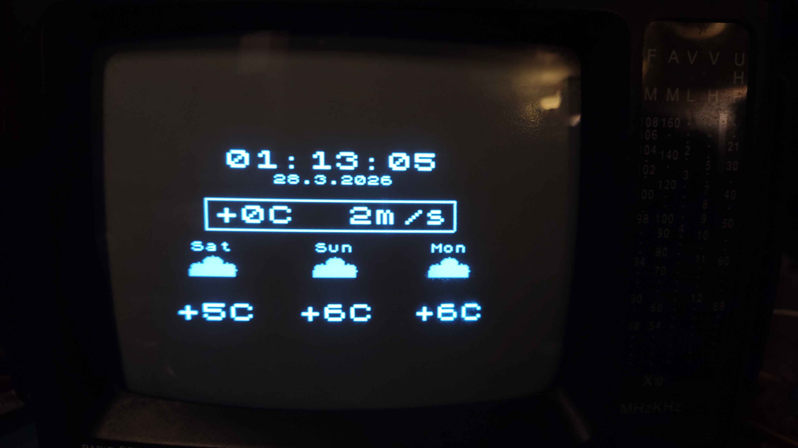
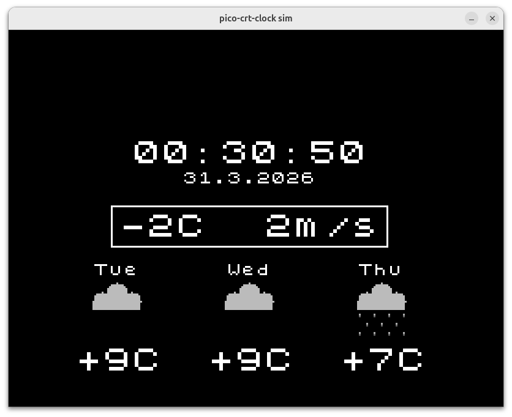

# pico-crt-clock

[MicroPython](https://github.com/micropython/micropython) firmware running
on first core of a Raspberry Pi Pico W,
driving a composite PAL CRT TV via a resistor-ladder DAC, using
[pico-mposite](https://github.com/breakintoprogram/pico-mposite) as the video
engine running on the second RP2040 core.

Displays a live clock, current temperature and wind speed, and a 3-day weather
forecast with icons, fetched from [Open-Meteo](https://open-meteo.com) (no API
key required).

---

## Gallery

| CRT display | PC simulator |
|---|---|
|  |  |

https://github.com/user-attachments/assets/1162584c-b029-4f1c-9379-bf67870d685d

---

## Hardware

| Item | Detail |
|---|---|
| MCU board | Raspberry Pi Pico W (WiFi used for NTP and weather) |
| Display | Any TV or monitor accepting a composite PAL signal |
| DAC | R-2R resistor ladder on GP0-GP4, see [pico-mposite for wiring](https://github.com/breakintoprogram/pico-mposite/blob/main/hardware/pcb/schematic/Pico-mposite.pdf) |

The DAC maps a 5-bit value to a voltage level:

| Value | Meaning |
|---|---|
| 0x00 | Sync tip |
| 0x10 | Black (blanking level) |
| 0x1F | White (peak luminance) |

The Python API uses palette indices **0 (black) ... 15 (white)**; the `gfx` module
adds `colour_base = 0x10` before writing to the framebuffer so pixel values never
reach sync level.

> **Note:** The R-2R ladder DAC works for a first test but has two practical
> shortcomings when used with a real composite display:
>
> - **Output impedance mismatch.** The ladder presents roughly 110 Ω to the
>   display's 75 Ω input, forming a voltage divider that reduces signal
>   amplitude and shifts all levels — sync, black, and white — away from the
>   composite video standard.
> - **No drive capability.** Without a buffer the ladder cannot properly source
>   current into a 75 Ω terminated input, which distorts levels further.
>
 Two branches address these issues with different hardware approaches:
>
> | Branch | Hardware | Code changes |
> |---|---|---|
> | [`blanking_test`](../../tree/blanking_test) | R-2R ladder + 2SC1815 emitter follower buffer | Corrected colour LUT that compensates for the level shift caused by the ladder's output impedance |
> | [`summing_amp_test`](../../tree/summing_amp_test) | Weighted resistor summing network + THS7314 video amplifier | Back porch level (HSHI) set to 0x10 to match `colour_base`, giving consistent black level |
>
> **Each branch contains firmware changes tuned specifically for its hardware.
> You must build and flash the firmware from the same branch as the hardware
> you have built. Mixing hardware from one branch with firmware from another
> will result in incorrect signal levels.**
>
> `summing_amp_test` is the recommended approach for a clean, standards-correct
> composite output. `blanking_test` is useful if you only have the basic ladder
> and want better results without additional ICs.

---

## Repository layout

```
pico-crt-clock/           project sources; build from here
  build.sh                  one-shot build + patch script
  micropython.cmake         build-system glue (USER_C_MODULES)
  gfx_queue.h               shared ring buffer + command struct (core0 <-> core1)
  gfx_core1.c               core1 entry point and command dispatcher
  gfx_core1.h               gfx_core1_launch() declaration
  mod_gfx.c                 MicroPython C extension module "gfx"
  main.py                   boot stub: imports clock, catches SystemExit
  clock.py                  clock/weather application logic
  config.py                 WiFi credentials, location, display options
  icons.py                  pre-generated weather icon bytearrays
  make_icons.py             PC-side icon generator (run to regenerate icons.py)
  gfx.py                    PC simulator mock of the gfx C extension (pygame)
  run_sim.py                runner for PC testing without hardware
  patches/
    micropython-no-thread.patch   disables MicroPython threading (see below)
    pico-mposite.patch            patches cvideo.c and cvideo.h (see below)

micropython/          vanilla MicroPython (submodule)
pico-mposite/         vanilla pico-mposite (submodule)
pico-sdk/             vanilla pico-sdk (submodule)
```

`cvideo_sync.pio.h` and `cvideo_data.pio.h` are generated by pioasm during the
build and are not committed.

---

## Architecture

The RP2040 has two cores. Core1 runs the pico-mposite video engine exclusively,
generating the composite PAL signal via PIO state machines and DMA. Core0 runs
MicroPython with a custom `gfx` C extension module (`mod_gfx.c`).

When `clock.py` calls a `gfx` function, `mod_gfx.c` encodes it as a command and
pushes it into a shared ring buffer (`gfx_queue`). Core1 loops on that queue,
popping commands and dispatching them to the pico-mposite drawing functions
(`gfx_core1.c`). The two cores communicate only through the queue; all video
IRQs (`DMA_IRQ_1`, `PIO0_IRQ_0`) are owned by core1.

**Key design points**

- All video IRQs (`DMA_IRQ_1`, `PIO0_IRQ_0`) are registered from core1 so they
  fire on core1's NVIC and cannot affect core0 interrupt latency.
- `patches/pico-mposite.patch` redirects DMA from `DMA_IRQ_0` to `DMA_IRQ_1`
  (avoiding conflict with MicroPython's shared DMA_IRQ_0 handler), adds
  `FJOIN_TX` to double the TX FIFO depth on both PIO SMs, places ISRs in SRAM
  with `__not_in_flash_func`, sets GP0-GP4 drive strength to 2 mA / slow slew
  to reduce switching noise, and adds `deinit_cvideo()`.
- `patches/micropython-no-thread.patch` sets `MICROPY_PY_THREAD = 0`; the
  threading ISR on `SIO_IRQ_PROC0` would consume the FIFO acknowledgement that
  `multicore_launch_core1()` blocks on, hanging core0.
- Core1 is launched with an explicit 4 KB static stack because MicroPython sets
  `PICO_CORE1_STACK_SIZE = 0`, which makes `multicore_launch_core1()` panic.
- `multicore_lockout_victim_init()` is called on core1 so MicroPython's flash
  write path (webREPL, USB MSC) can safely pause core1; without it the lockout
  handshake deadlocks. DMA/PIO keep running during the lockout.
- Back-to-back `gfx.blit()` calls are safe: core0 spins on `gfx_blit_busy`
  until core1 has consumed the previous sprite, then copies the next one.

---

## Prerequisites

- ARM cross-compiler: `gcc-arm-none-eabi`
- `cmake`, `make`, `git`, `python3`

On Debian/Ubuntu:

```bash
sudo apt install gcc-arm-none-eabi cmake make git python3
```

## Build

All submodules are kept vanilla. `build.sh` applies the patches before
building and reverts them on exit via `trap` - they are always restored even
if the build fails.

```bash
cd pico-crt-clock
./build.sh
```

The script:
1. Initialises top-level submodules (micropython, pico-mposite, pico-sdk) and MicroPython's own submodules (tinyusb, ...)
2. Applies `patches/micropython-no-thread.patch` and `patches/pico-mposite.patch`
3. Builds `mpy-cross` if needed
4. Runs cmake (out-of-tree into `../build-RPI_PICO_W/`), builds pioasm,
   generates `cvideo_sync.pio.h` / `cvideo_data.pio.h`
5. Builds the full firmware with the `gfx` user C module
6. Reverts both patches (via `trap EXIT`)

Output: `build-RPI_PICO_W/firmware.uf2`

### Flash

Hold BOOTSEL, plug in USB, release. Then:

```bash
cp build-RPI_PICO_W/firmware.uf2 /media/$USER/RPI-RP2/
```

### Deploy Python files

After the Pico reboots, connect to PC:

```bash
mpremote fs cp pico-crt-clock/main.py    :main.py
mpremote fs cp pico-crt-clock/clock.py   :clock.py
mpremote fs cp pico-crt-clock/icons.py   :icons.py
mpremote fs cp pico-crt-clock/config.py  :config.py
```

Edit `config.py` first - it contains your WiFi credentials and all display
options: location (lat/lon), timezone, DST, temperature and wind units,
date format, and 12/24 hour clock.

If you change icons, regenerate `icons.py` on the PC first:

```bash
cd pico-crt-clock && python make_icons.py
```

---

## PC simulator

```bash
cd pico-crt-clock
pip install pygame   # one-time
python run_sim.py
```

`gfx.py` is a pygame-based mock of the `gfx` C extension. Network calls are
always-connected mocks; weather is fetched live from Open-Meteo.
Set `SCALE` in `gfx.py` to resize the window (default 3x).

---

## Python API

```python
import gfx

# Lifecycle
gfx.init()                              # Launch core1 video engine (call once)
gfx.deinit()                            # Stop video engine; core1 parks in WFE

# Display control
gfx.cls(colour)                         # Clear screen; waits for vblank first
gfx.wait_vblank()                       # Block until next vertical blank
gfx.set_border(colour)                  # Set overscan border colour

# Drawing  - colour is 0 (black) ... 15 (white)
gfx.plot(x, y, colour)
gfx.line(x0, y0, x1, y1, colour)
gfx.hline(y, x0, x1, colour)
gfx.circle(x, y, r, colour, filled)
gfx.triangle(x0, y0, x1, y1, x2, y2, colour, filled)
gfx.polygon(x0, y0, x1, y1, x2, y2, x3, y3, colour, filled)

# Text - colour indices as above; bg/fg are background/foreground
gfx.print_char(x, y, char_int, bg, fg)
gfx.print_string(x, y, string, bg, fg)       # 1x scale (8x8 px per glyph)
gfx.print_string_2x(x, y, string, bg, fg)    # 2x scale (16x16 px per glyph)
gfx.scroll_up(colour, rows)

# Sprites
gfx.blit(buf, sw, sh, dx, dy)
# buf  - bytes or bytearray, sw*sh bytes, one byte per pixel (values 0-15)
# sw   - sprite width in pixels
# sh   - sprite height in pixels
# dx   - destination X on screen
# dy   - destination Y on screen
# gfx.blit() adds colour_base (0x10) automatically.
# Maximum sprite size: 256x32 px (GFX_BLIT_BUFSIZE = 8192 bytes).
# Back-to-back blits are safe - core0 waits on gfx_blit_busy automatically.
```

### Colour palette

The display is monochrome. Colour indices map linearly to luminance:

```
0  = black
7  = mid-grey
15 = white
```

---

## Screen geometry

Default video mode: **256 x 192 pixels**, PAL(ish) timing (~312 lines, 50 Hz).
Coordinate origin is top-left.

---

## Known limitations

- **Queue depth** - the command ring buffer holds 64 entries. Pushing more than
  64 commands without core1 draining them will block core0 indefinitely.
